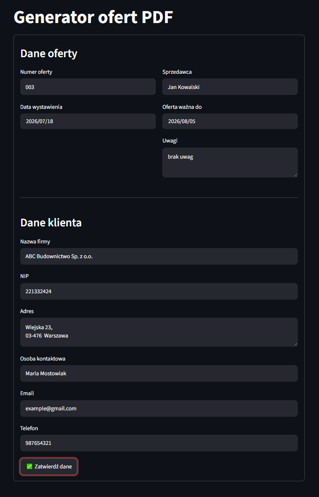
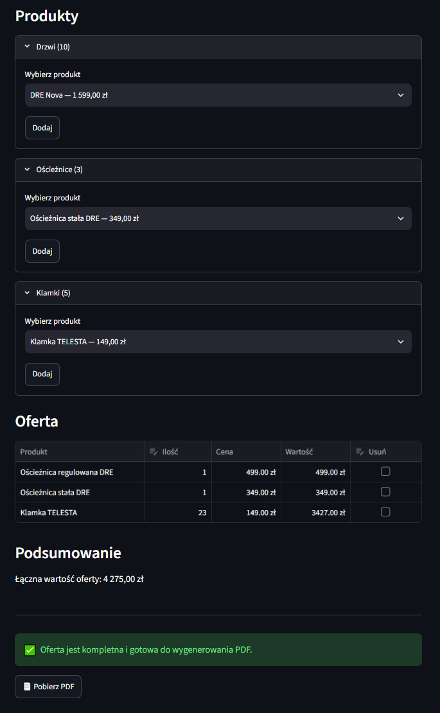
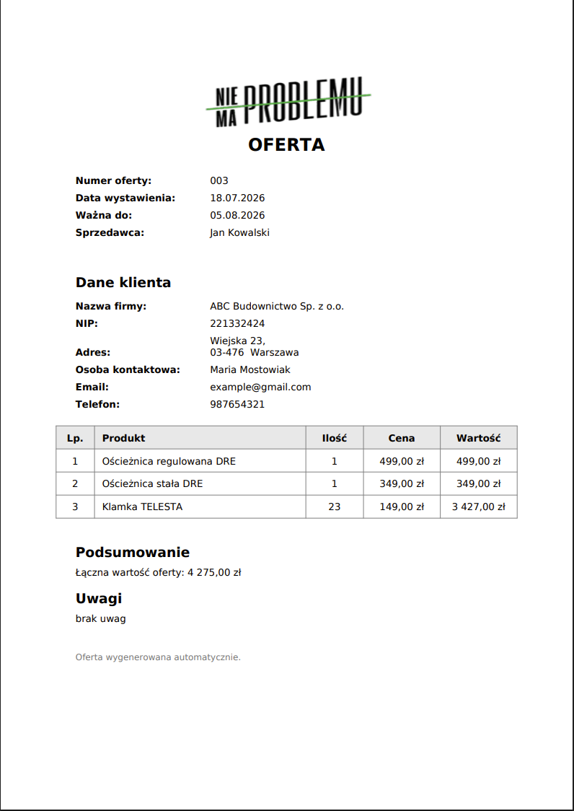

# 📄 PDF Offer Generator

A web application for creating professional PDF offers for customers. The application allows users to prepare quotations, manage products, calculate totals, validate required information, and generate a ready-to-send PDF document.

## 🚀 Live Demo

[https://offer-generator-app.streamlit.app](https://offer-generator-app.streamlit.app)

The application provides an interactive interface for preparing customer offers and generating ready-to-send PDF documents.

The project was built as a Proof of Concept with a strong focus on clean architecture, domain modeling, and maintainable code.

---

# 📸 Screenshots

## Main Application

The main screen allows users to enter offer details and customer information before creating the quotation.



---

## Product Selection

Products are grouped by category. Users can add products, modify quantities, review the quotation, and download the generated PDF.



---

## Generated PDF

Example of the generated PDF offer ready to be sent to the customer.



---

# ✨ Features

- Create customer quotations
- Manage customer information
- Browse products grouped by category
- Automatically merge duplicate products
- Edit product quantities
- Remove products from the quotation
- Automatic quotation value calculation
- Validation before PDF generation
- Generate professional PDF documents
- Unit tests for business logic

---

# 🛠 Tech Stack

- Python 3.11
- Streamlit
- ReportLab
- Pytest

---

# 🏛 Architecture

The application follows a layered architecture inspired by Domain-Driven Design (DDD).

```text
UI
│
├── Application
│
├── Domain
│
└── Infrastructure
```

### UI

Responsible only for user interaction.

Examples:

- Customer Form
- Product Selector
- Offer Table
- Validation Panel

---

### Application

Coordinates business operations and communication between the UI and domain layer.

Examples:

- QuoteService
- ProductService
- PdfService

---

### Domain

Contains the core business logic.

Examples:

- Quote
- QuoteItem
- Product
- Customer
- OfferDetails

---

### Infrastructure

Responsible for loading external resources such as product data.

---

# 📁 Project Structure

```text
.
├── application/
├── data/
│   ├── fonts/
│   ├── images/
│   ├── screenshots/
│   └── products.csv
├── domain/
├── infrastructure/
├── tests/
├── ui/
├── utils/
├── app.py
└── requirements.txt
```

---

# 🚀 Installation

Clone the repository:

```bash
git clone https://github.com/Goldmanski/offer-generator.git
cd offer-generator
```

Create a virtual environment:

```bash
python -m venv .venv
```

Activate it.

### Windows

```bash
.venv\Scripts\activate
```

### Linux / macOS

```bash
source .venv/bin/activate
```

Install dependencies:

```bash
pip install -r requirements.txt
```

---

# ▶️ Run

Start the application with:

```bash
streamlit run app.py
```

---

# 📄 Example Workflow

1. Fill in offer details.
2. Enter customer information.
3. Select products from the catalog.
4. Modify product quantities.
5. Review the calculated total.
6. Validate the quotation.
7. Generate the PDF.
8. Download the finished document.

---

# 🧪 Tests

Run all tests:

```bash
pytest
```

---

# 🎯 Design Goals

The project focuses on:

- Clean Architecture
- Separation of responsibilities
- Encapsulated business logic
- Readable and maintainable code
- Domain-first approach
- Testable components

---

# 🔮 Possible Future Improvements

- Database integration
- Authentication and user accounts
- Customer management
- Offer history
- Product search and filtering
- Export to additional formats
- REST API
- ERP integration

---

# 👤 Author

Created by **Eliasz Nowicki** as a portfolio project focused on Python, Clean Architecture, Domain-Driven Design, and business application development.